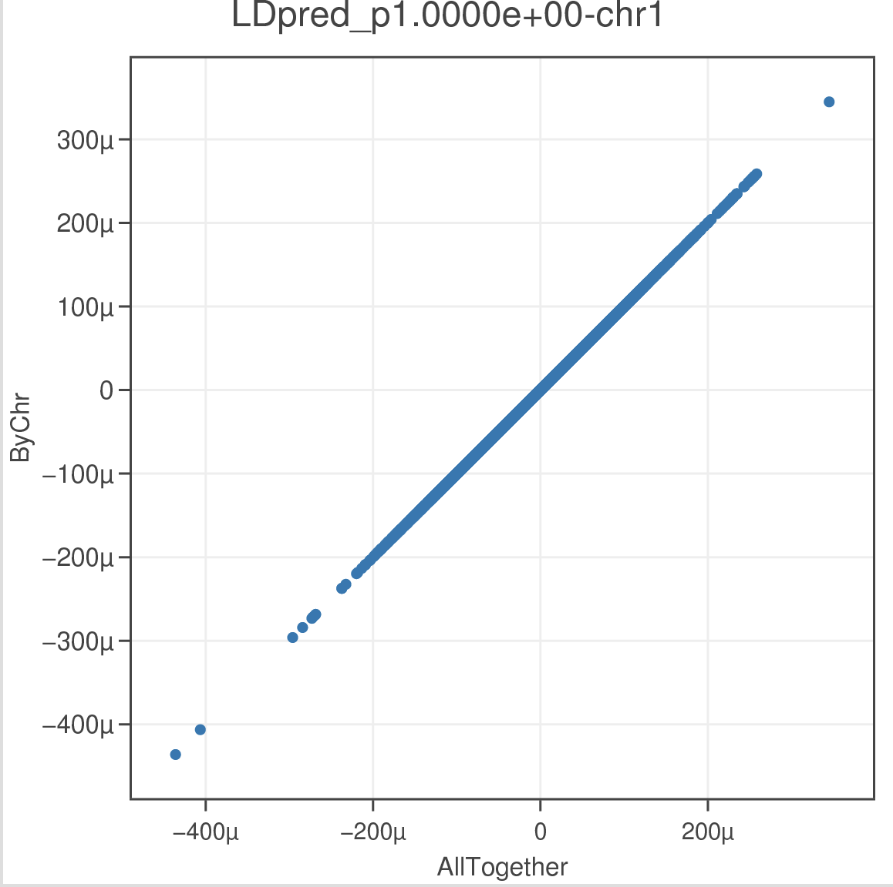

## Run LDpred chromosome by chromosome

=======================

*This is an ad hoc modification of the source code of the original LDpred code to make it can be run in parallel chr by chr. Full credit and copyright should be granted to the LDpred author. If there's violation of the copyright of LDpred, please let me know, I will delete all these codes and tutorials.*

```
THE SOFTWARE IS PROVIDED "AS IS", WITHOUT WARRANTY OF ANY KIND,
EXPRESS OR IMPLIED, INCLUDING BUT NOT LIMITED TO THE WARRANTIES
OF MERCHANTABILITY, FITNESS FOR A PARTICULAR PURPOSE AND NONINFRINGEMENT.
IN NO EVENT SHALL THE AUTHORS OR COPYRIGHT HOLDERS BE LIABLE FOR ANY CLAIM,
DAMAGES OR OTHER LIABILITY, WHETHER IN AN ACTION OF CONTRACT, TORT OR OTHERWISE,
ARISING FROM, OUT OF OR IN CONNECTION WITH THE SOFTWARE
OR THE USE OR OTHER DEALINGS IN THE SOFTWARE.
```

### Philosophy
This is trying to have a minimal twist of the LDpred code to make it can be run in parallel chromosome by chromosome. This is neither a guarantee of a cleaning code nor a full structured or a full documented of the modification of the code. However, I will try my best to have benchmarks with original LDpred software to try my best to guarantee the results are accuracy. If you found any bug related to the discrepancy of this pipeline with original LDpred, please let me know. I am happy to fix that.

For the original LDpred, it actually runs LD structure estimation and the effect size reweighing step chr by chr, but for the later reweighing step, it needs the global estimation of genome-wide heritability and inflation factor.__In this pipeline, we split these processes as two steps: 1) Estimate LD structure chr by chr, and also gather the parameters for estimating of genome-wide heritability and inflation factor. 2) Estimate genome-wide heritability and inflation factor(this is very cheap), and put this parameters for reweighing beta values chr by chr.__ By this way, we can parallel the computing chr by chr, which will dramatically reduce the memory load and the waiting time. But before we run step 2, __We have to wait all the computing is done in step 1__, as we need the information from all chrs to have a global estimation of genome-wide heritability and inflation factor

#### Install the LDpred software
Please install the LDpred software following the instruction from [here](https://github.com/bvilhjal/ldpred)[https://github.com/bvilhjal/ldpred], the input and output file format is the same as the LDpred, please read through the instruction from LDpred software. The instruction is detailed at the github respository of LDpred [https://github.com/bvilhjal/ldpred].

#### Find the location for your LDpred.
Find the location for your LDpred source code. This is usually where you install your python packages.
```
# for me, it's: /medpop/esp2/wallace/tools/miniconda3/envs/Python27/lib/python2.7/site-packages/ldpred
# Where you will found below sources.
ls LDpred_*
LDpred.py
LDpred.pyc
LDpred_inf.py
LDpred_inf.pyc
```

#### Download all these .py files hosted here, and put it the same location as ```LDpred.py```
Put all these .py files in this repository alone with your ```LDpred.py```. [Click here to download as zip files](https://minhaskamal.github.io/DownGit/#/home?url=https:%2F%2Fgithub.com%2Fwavefancy%2FWallaceBroad%2Ftree%2Fmaster%2Fpython%2FLDPred.CHRbyCHR)

Please over-write the ```coord_genotypes.py```, it was just changed the header to point to python2. __Please also aware that LDpred currently only support python2__ . You can easily maintain multiple version of python by [miniconda](https://conda.io/miniconda.html)[https://conda.io/miniconda.html]. If you don't want to put the path for these files every time, you can give them executable permission, and append the path of these files in the $PATH environment variable.
```
chmod +x LDpred.ScaleEffectSize.CHR.Numpy.Wallace.V1.py LDpred.ScaleEffectSize.CHR.Scipy.Wallace.V1.py LDpred.getLocalLDFile.CHR.Wallace.V1.py coord_genotypes.py
```

### Start run LDpred chr by chr
#### 1) Coordinate the LD reference panel and summary statistics.
The LD reference panel is in plink bed/fam/bim format, the input summary statistics format please refer LDpred instruction. Please make sure the snp id is consistent between LD reference panel with the summary statistics. __Please split the LD reference panel and summary statistics chr by chr, we will parallel them starting from here.__

```
# parallel is GUN parallel program [https://www.gnu.org/software/parallel/].
# wecho is a my python script in this repository, which depends on docopt for parse args,
# just reformat the command line, skip comments and generate a single line.
# You can use bash for-loop to replace my style here.

parallel -j 1 -q wecho "
    # remove the old file is exist
    rm -f data/coord.file.chr{}
    &&
    # coord_genotypes.py
    # Please change the full path to your path accordingly.
    # Or skip the path if you already set the $PATH variable.
    /medpop/esp2/wallace/tools/miniconda3/envs/Python27/lib/python2.7/site-packages/ldpred/coord_genotypes.py
        # LD ref. file.
        --gf=data/ldref.chr{}
        # sample size for summary statistics.
        --N=$nsamples
        # summary stat.
        --ssf=data/refined.summary.chr{}.txt
        --ssf_format=BASIC
        --out data/coord.file.chr{}
    &>log/1-3.chr{}.log
" :::: <(seq 1 1 22)

#------input example------------
# please make sure the SNP_ID is the same
head -n 3 data/ldref.chr5.bim
5       5:12225 0       12225   G       A
5       5:13018 0       13018   C       A
5       5:13125 0       13125   G       T

head -n 5 data/refined.summary.chr5.txt
hg19chrc        snpid   a1      a2      bp      or      p
chr5    5:12225 A       G       12225   1.0190134975182332      0.2056484
chr5    5:13018 A       C       13018   1.0130757496370328      0.3684451
chr5    5:13125 T       G       13125   1.0161723798789917      0.2628437
chr5    5:13739 D       I       13739   1.0163481929080993      0.2762581

```

#### 2) Generate the LD structure file and summary for estimating of heritability and inflation factor.
```
pp -j 1 -q wecho "
    LDpred.getLocalLDFile.CHR.Wallace.V1.py
        # coord file, from step 1.
        --coord data/coord.file.chr{}
        # sample size for summary statistics.
        --N=$nsamples
        # about total_num_of_snp(genome widely)/3000, corresponding 1m on each side of the focal snp.
        # please refer to LDpred instruction.
        --ld_radius=$lr
        # generated LD structure file.
        # An extra file of data/ld_file_chr{}.gz_byFileCache.txt will also be genrated,
        # which store the chr-specific parameter for heritability and inflation factor estimation.
        --local_ld_file=data/ld_file_chr{}.gz
    &>log/1-4.chr{}.log
" :::: chr.sh
```

#### 3) Wait all chr done in step 2. Reweigh the beta value by LDpred.

```
pp -j 1 -q wecho "
    # Here we used numpy version for SVD.
    # If you get error as "SVD did not converge in Linear Least Squares".
    # Try the scipy version.
    # This step sometimes is not stable for my version of python.

    LDpred.ScaleEffectSize.CHR.Numpy.Wallace.V1.py
        # coord file from step1.
        --coord data/coord.file.chr{}
        # sample size for summary statistics.
        --N=$nsamples
        # num_of_snp/3000, corresponding 1m on each side of the focal snp.
        --ld_radius=$lr
        # LD structure from step2.
        --local_ld_file=data/ld_file_chr{}.gz
        # output reweighed beta.
        --out=data/numpy.effect.ldpred.chr{}
    &>log/1-5.chr{}.log
    &&
        gzip data/numpy.effect.ldpred.chr{}_LDpred*
" :::: chr.sh
```
In this step, SVD sometimes is not stable, I usually use Numpy, if failed try scipy again.
__It's the user's responsibility to make sure all the cached files for the heritability and inflation factor estimation are fully loaded, please check the log information from the last step to confirm it.__ You will find some thing like below.
```
WALLACE INFO: load chromosome level summary file pattern: /medpop/esp2/wallace/projects/Amit/PRS/CAD_1KG/data/*_byFileCache.txt
WALLACE INFO: *** please make sure all files have been loaded!****
WALLACE INFO: load chromosome level summary file: /medpop/esp2/wallace/projects/Amit/PRS/CAD_1KG/data/ld_file_chr1.gz_byFileCache.txt
WALLACE INFO: load chromosome level summary file: /medpop/esp2/wallace/projects/Amit/PRS/CAD_1KG/data/ld_file_chr10.gz_byFileCache.txt
WALLACE INFO: load chromosome level summary file: /medpop/esp2/wallace/projects/Amit/PRS/CAD_1KG/data/ld_file_chr11.gz_byFileCache.txt
WALLACE INFO: load chromosome level summary file: /medpop/esp2/wallace/projects/Amit/PRS/CAD_1KG/data/ld_file_chr12.gz_byFileCache.txt
WALLACE INFO: load chromosome level summary file: /medpop/esp2/wallace/projects/Amit/PRS/CAD_1KG/data/ld_file_chr13.gz_byFileCache.txt
WALLACE INFO: load chromosome level summary file: /medpop/esp2/wallace/projects/Amit/PRS/CAD_1KG/data/ld_file_chr14.gz_byFileCache.txt
WALLACE INFO: load chromosome level summary file: /medpop/esp2/wallace/projects/Amit/PRS/CAD_1KG/data/ld_file_chr15.gz_byFileCache.txt
WALLACE INFO: load chromosome level summary file: /medpop/esp2/wallace/projects/Amit/PRS/CAD_1KG/data/ld_file_chr16.gz_byFileCache.txt
WALLACE INFO: load chromosome level summary file: /medpop/esp2/wallace/projects/Amit/PRS/CAD_1KG/data/ld_file_chr17.gz_byFileCache.txt
WALLACE INFO: load chromosome level summary file: /medpop/esp2/wallace/projects/Amit/PRS/CAD_1KG/data/ld_file_chr18.gz_byFileCache.txt
WALLACE INFO: load chromosome level summary file: /medpop/esp2/wallace/projects/Amit/PRS/CAD_1KG/data/ld_file_chr19.gz_byFileCache.txt
WALLACE INFO: load chromosome level summary file: /medpop/esp2/wallace/projects/Amit/PRS/CAD_1KG/data/ld_file_chr2.gz_byFileCache.txt
WALLACE INFO: load chromosome level summary file: /medpop/esp2/wallace/projects/Amit/PRS/CAD_1KG/data/ld_file_chr20.gz_byFileCache.txt
WALLACE INFO: load chromosome level summary file: /medpop/esp2/wallace/projects/Amit/PRS/CAD_1KG/data/ld_file_chr21.gz_byFileCache.txt
WALLACE INFO: load chromosome level summary file: /medpop/esp2/wallace/projects/Amit/PRS/CAD_1KG/data/ld_file_chr22.gz_byFileCache.txt
WALLACE INFO: load chromosome level summary file: /medpop/esp2/wallace/projects/Amit/PRS/CAD_1KG/data/ld_file_chr3.gz_byFileCache.txt
WALLACE INFO: load chromosome level summary file: /medpop/esp2/wallace/projects/Amit/PRS/CAD_1KG/data/ld_file_chr4.gz_byFileCache.txt
WALLACE INFO: load chromosome level summary file: /medpop/esp2/wallace/projects/Amit/PRS/CAD_1KG/data/ld_file_chr5.gz_byFileCache.txt
WALLACE INFO: load chromosome level summary file: /medpop/esp2/wallace/projects/Amit/PRS/CAD_1KG/data/ld_file_chr6.gz_byFileCache.txt
WALLACE INFO: load chromosome level summary file: /medpop/esp2/wallace/projects/Amit/PRS/CAD_1KG/data/ld_file_chr7.gz_byFileCache.txt
WALLACE INFO: load chromosome level summary file: /medpop/esp2/wallace/projects/Amit/PRS/CAD_1KG/data/ld_file_chr8.gz_byFileCache.txt
WALLACE INFO: load chromosome level summary file: /medpop/esp2/wallace/projects/Amit/PRS/CAD_1KG/data/ld_file_chr9.gz_byFileCache.txt
WALLACE INFO: totally loaded chr: 22
```

#### 4) Combine all the reweighed file together.
#### 5) Score your samples by the reweighed beta value. I usually use plink.
```
# Validate data
# --score my.scores 3 2 1 [id,allele,score]
# reads variant IDs from column 3, allele codes from column 2, and scores from column 1.
source config.sh
pp -j 1 -q wecho "
    plink
        --bfile data/all.chr
        --allow-no-sex
        --score <(zcat ${sum}{}.gz  | wcut -t 'sid,nt2,ldpred_beta' ) 1 2 3
        --out results/score.{}
    &&
    gzip -f results/score.{}.profile
" :::: lds.sh

# lds are the proportion of causal setting in LDpred.
cat lds.sh
LDpred-inf
LDpred_p1.0000e+00
LDpred_p1.0000e-01
LDpred_p1.0000e-02
LDpred_p1.0000e-03
LDpred_p3.0000e-01
LDpred_p3.0000e-02
LDpred_p3.0000e-03
```

### Bechmark of this pipeline with LDpred's load as a whole approach.
Please check the chr1.png and all.LDpred_p1.0000e+00.png, the results are identical.


